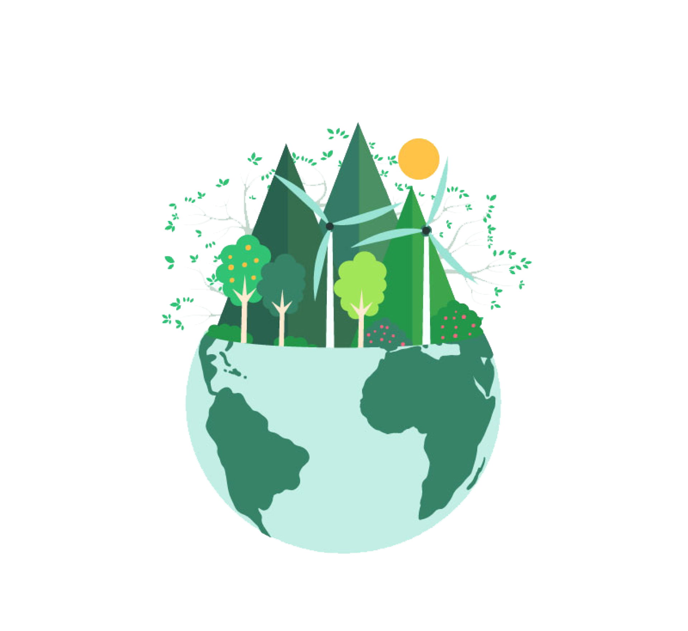

# EcoQuest 🌿

EcoQuest - это интерактивный веб-проект, посвященный экологическому образованию и повышению осведомленности о защите окружающей среды.

## 🚀 Функционал

### 1. Главная страница
- Привлекательный лендинг с анимированными элементами
- Навигация к различным разделам сайта

### 2. Экологический квиз
- Интерактивный тест из 15 вопросов (возможность расширить) по экологической тематике
- Мгновенная обратная связь по ответам
- Результаты с рекомендациями после завершения

### 3. Карта пунктов переработки
- Интерактивная карта на основе Яндекс.Карт
- Отображение пунктов переработки в г. Белгород
- Возможность поиска ближайших пунктов приема вторсырья
- Информация о типах принимаемых материалов

### 4. Полезные рекомендации
- Практические советы по экологичному образу жизни
- Рекомендации в различных категориях (энергосбережение, экономия воды и др.)
- Информация о том, как каждый может внести свой вклад в защиту планеты

## 📱 Как пользоваться

1. **Навигация**
   - Используйте шапку сайта для перемещения между разделами
   - Нажимайте на соответствующие кнопки для плавной прокрутки к нужным секциям

2. **Прохождение квиза**
   - Нажмите на кнопку "Начать квест" на главной странице
   - Выберите ответ на каждый вопрос
   - После завершения увидите свой результат и рекомендации

3. **Использование карты**
   - На карте отмечены пункты приема вторсырья
   - Нажмите на метку, чтобы увидеть информацию о пункте
   - Используйте кнопку "Найти пункты переработки" для обновления данных
   - Воспользуйтесь поиском для нахождения ближайших пунктов

4. **Изучение рекомендаций**
   - Ознакомьтесь с советами по различным категориям
   - Применяйте полученные знания в повседневной жизни

## 🛠️ Технологии

- **Frontend**: React 19, TypeScript
- **Стилизация**: TailwindCSS 4
- **Анимации**: Framer Motion
- **Сборка**: Vite 6
- **Карты**: Yandex Maps API
- **UI компоненты**: 
  - Material UI
  - React Icons
- **Линтинг**: ESLint
